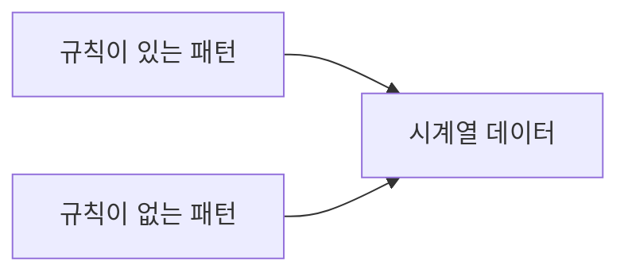
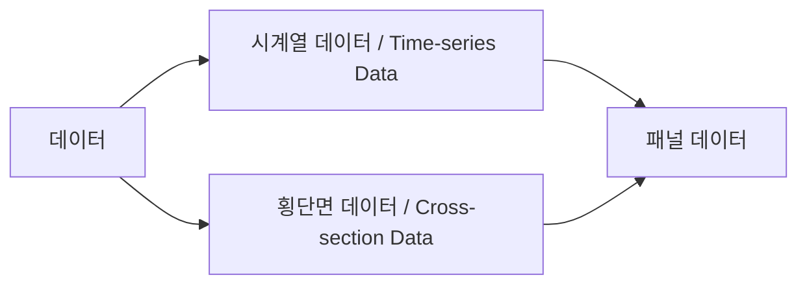

[TOC]

# 1. 잡음(Noise)이란 무엇인가?

## 1) 정의

노이즈란 필요치 않은 데이터를 의미

# 2. 데이터의 분류

수집된 데이터는 횡단면 데이터와(Cross-section Data), 시계열 데이터(Time-series Data)로 분류할 수 있다.

횡단면 데이터는 특정 시점에서 여러 변수들의 값을 측정한 데이터를 의미한다.

시계열 데이터는 하나의 변수에 대해 시간 순서대로 측정한 데이터를 의미한다.

그리고 횡단면과 시계열 데이터가 합쳐진 것을 패널 데이터라고 부른다.

## 1) 패널 / 시계열/ 횡단면

## 1-1) 패널 데이터

| Year | A의 주가 | B의 주가 | C의 주가 |
| :--: | :------: | :------: | :------: |
| 2018 |  56.75   |  214.35  |  122.21  |
| 2019 |  58.79   |  205.21  |  110.11  |
| 2020 |  66.72   |  207.44  |  99.87   |

## 1-2) 시계열 데이터

| Year | A의 주가 |
| :--: | :------: |
| 2018 |  56.75   |
| 2019 |  58.79   |
| 2020 |  66.72   |

## 1-3) 횡단면 데이터

| Year | A의 주가 | B의 주가 | C의 주가 |
| :--: | :------: | :------: | :------: |
| 2018 |  56.75   |  214.35  |  122.21  |

# 신호(Signal)와 시스템(System)

## 1) 신호의 정의

신호는 물리량의 변화 형태를 담은 데이터/정보의 집합이다.

신호는 다양한 물리적 현상의 동작 또는 성질을 표현한 것으로, 신호가 변화하는 패턴 속에 사람들이 필요로 하는 정보가 담겨 있다.

신호는 수학적으로 독립변수의 함수로 표현되는데, 시간, 공간, 주파수 등이 독립변수로 쓰인다.

## 2) 시스템의 정의

특정한 목적에 맞도록 주어진 신호를 조작하고 처리해내는 장치.

시스템은 들어오는 신호에 대한 반응으로 다른 신호를 만들어낸다.

시스템은 입력, 출력, 동작 규칙에 의해 명확하게 규정되며, 수학적으로 하나 또는 여러 개의 방정식으로 표현된다. 

즉 시스템은 바라는 목적을 달성하는 데 필요한 기기(device), 공정(process), 알고리즘(algorithm) 등의 각종 구성 요소(component)의 집합체.

## 3) 표현

### 시각적 표현: 파형과 블록선도

생략-

### 이론적 표현: 수학적 모형화

- 신호는 함수로 표현된다. `(=주파수 스펙트럼(Frequency spectrum))`
- 시스템은 방정식으로 표현된다.

신호와 시스템의 본질을 간결하게 수식으로 표현하는 방법이다.

수학적 모형은 실제 신호와 시스템을 한 치의 오차 없이 완벽하게 표현한 것이 아니라 핵심적인 특성을 이상화시켜 나타낸 것이다.

오차가 발생하더라도 신호와 시스템의 기본적인 특성을 묘사하거나 해석하는 데 문제가 없으면 무시할 수 있다.

수학적 모형은 시간 영역과 주파수 영역, 두 가지 수학적 표현이 가능하다. 

시간 영역 표현은 실험과 관측을 통해 직접 표현이 가능하나 주파수 영역 표현은 시간 영역 표현을 수학적으로 변환하여 얻는다.

# 시계열에 대한 접근 - 데이터 마이닝, 통신이론(정보이론), 통계(시계열 분석)

크게 시간 영역과 주파수 영역으로 나누어 생각할 수 있다. 

이 중 시간 영역은 통계에서 많이 다루며 계량경제학 같은 곳에서도 시간 영역을 기준으로 데이터에 통계적 기법을 적용한다.

반면 주파수 영역은 전자공학에서 말하는 신호 처리, 더 나아가서는 통신(정보)이론과 관련이 있으며 그 성질이 시간 영역과는 상이하게 다르므로 사용되는 기법들 또한 성질이 다르다.

## 1) 시간 영역 (Time domain)

시간을 독립변수 가지는 영역. 

우리가 흔히 생각하는 국가의 연도별 GDP, 주식 시장의 시간별 주가, 100ms 단위의 CNC 센서 위치 데이터 등, 전형적인 시계열 데이터가 time domain에 속한다.

## 2) 주파수 영역 (Frequency domain)

주파수를 독립변수 가지는 영역.

주파수와 관련된 수학적 함수나 물리적 신호를 분석한 것.

## 3) 푸리에 변환

시간 영역에서 데이터가 주기 신호를 가질 때 푸리에 급수를 쓰면 놀랍게도 이를 주파수 영역으로 나타낼 수 있다.

그러나 시간 영역의 데이터가 비주기적 신호를 가질 때는 이것이 불가능하다.

하지만 푸리에 변환을 사용하면 비주기적 신호도 주파수 영역으로 표현할 수 있다.

푸리에 변환의 가장 핵심적인 부분은 시간 영역에서의 어떠한 연속적인 신호도 사인 곡선의 합으로 나타내는 것이다.

# 노이즈와 중심극한정리, 가우시안 분포

# 필터란 무엇인가?

특정한 신호에서 원치 않는 신호를 차단하거나 원하는 신호만 통과시키는 기능을 하는 장치나 그러한 과정을 의미한다.

예를 들어 칼만 필터는 물리적 장치가 아닌 알고리즘.

# 통계학적 필터

## 칼만 필터 (Kalman Filter)

잡음이 포함된 데이터의 선형 역학계를 추정하는 재귀 필터. 

## 위너 필터 (Wiener Filter)

## 사비츠키-골레이 필터

## bilateral 필터

이미지 필터

# 노이즈 처리를 위한 머신 러닝/딥 러닝 방법들

## 1) PCA

머신 러닝에서는 주성분분석(PCA)과 같은 기법을 통해 차원을 축소하고 잡음을 감소시키는 효과도 있다고 알려져 있다.

하지만 엄밀한 의미에서 PCA의 주 목적은 차원 축소이며 잡음 제거에는 어느 정도의 효과가 있는지 의심스러운 부분이 많다.

간단하게 PCA를 통해 어느 정도의 잡음이 제거 되었느냐는 SNR을 통해 확인해볼 수 있을 텐데 이를 비교해놓은 자료는 상당히 찾기 어렵다.

물론 PCA를 기반으로 하는 denoising 기법들이 많이 제안되고 있으나 PCA 그 자체만으로 잡음 감소와 제거에 효과적이냐는 의문 부호가 붙는다.

## 2) 오토인코더

Convolutional AutoEncoder

LSTM Stacked AutoEncoder

# 11. 신호와 잡음 평가 - SNR과 PSNR

## 1) SNR (Signal to Noise Ratio)

신호 대 잡음비로 신호 크기와 잡음 신호 크기의 비율을 의미한다.

신호와 잡음의 평균 Power로 비교한다.

## 2) PSNR (Peak Signal to Noise Ratio)

SNR에서 Power를 평균이 아닌 최대치를 기준으로 했을 때의 비율.

# References

[시계열 분석 이론의 기초 :: Y.LAB (tistory.com)](https://yamalab.tistory.com/112)

[RNN과 LSTM을 이해해보자! · ratsgo's blog](https://ratsgo.github.io/natural language processing/2017/03/09/rnnlstm/)

[금융 시계열 데이터에서 노이즈 제거하기 — QRAFT (qraftec.com)](https://www.qraftec.com/blog/2019/3/6/deep-time-series-denosier)

[시계열 분석(Time Series Analysis)-개괄 : 네이버 블로그 (naver.com)](https://blog.naver.com/PostView.nhn?blogId=bluefish850&logNo=220725222798&categoryNo=17&parentCategoryNo=0&viewDate=&currentPage=1&postListTopCurrentPage=&from=postList&userTopListOpen=true&userTopListCount=5&userTopListManageOpen=false&userTopListCurrentPage=1)

[시계열 분석(Time Series Analys.. : 네이버블로그 (naver.com)](https://blog.naver.com/bluefish850/220749045909)

[[3과목\] 데이터 분석 - 시계열 분석 : 네이버 블로그 (naver.com)](https://blog.naver.com/PostView.nhn?blogId=tjsqjavmfh&logNo=220863099958&proxyReferer=https:%2F%2Fwww.google.com%2F)

[Time Domain Analysis vs Frequency Domain Analysis: A Guide and Comparison | Advanced PCB Design Blog (cadence.com)](https://resources.pcb.cadence.com/blog/2020-time-domain-analysis-vs-frequency-domain-analysis-a-guide-and-comparison)

[잡음(Noise)과 불규칙성(randomness)에 대한 모델링 | Issac Lee (theissaclee.com)](https://www.theissaclee.com/ko/courses/rstat101/week9/)

[푸리에 변환 : 네이버 블로그 (naver.com)](https://blog.naver.com/PostView.nhn?blogId=miseos&logNo=221300882824&proxyReferer=https:%2F%2Fwww.google.com%2F)

[[금융 머신러닝\] 금융 데이터 이해의 중요성 | Q's Tech blog (karl6885.github.io)](https://karl6885.github.io/deep_learning/finance/2020/10/04/금융-머신러닝-0-금융-데이터-이해의-중요성/)

[gimmesilver's blog (zum.com)](http://egloos.zum.com/Agbird/v/5619572)

[gimmesilver's blog : 빅데이터는 왜 필요한가... (egloos.com)](http://agbird.egloos.com/5493072)

[1 – The Importance of Domain Knowledge – Machine Learning Blog | ML@CMU | Carnegie Mellon University](https://blog.ml.cmu.edu/2020/08/31/1-domain-knowledge/)

[주성분 분석(PCA) - 공돌이의 수학정리노트 (angeloyeo.github.io)](https://angeloyeo.github.io/2019/07/27/PCA.html)

[사비츠키-골레이(Savitzky-Golay) 필터 - 공돌이의 수학정리노트 (angeloyeo.github.io)](https://angeloyeo.github.io/2020/10/21/Savitzky_Golay.html)

[Unsupervised Pre-training of a Deep LSTM-based Stacked Autoencoder for Multivariate Time Series Forecasting Problems | Scientific Reports (nature.com)](https://www.nature.com/articles/s41598-019-55320-6)

[Estimation theory - Wikipedia](https://en.wikipedia.org/wiki/Estimation_theory)

[Drone's DIYer :: 칼만 필터(Kalman filter) (tistory.com)](https://sharehobby.tistory.com/entry/칼만-필터Kalman-filter1)

[Double Star :: 'DIP & 라즈베리파이 & 아두이노 & 웹개발 & 논문리뷰' 카테고리의 글 목록 (tistory.com)](https://d-tail.tistory.com/category/DIP %26 라즈베리파이 %26 아두이노 %26 웹개발 %26 논문리뷰)

[Similarities and differences between regression and estimation - Cross Validated (stackexchange.com)](https://stats.stackexchange.com/questions/33286/similarities-and-differences-between-regression-and-estimation)

[필터 (신호 처리) - 위키백과, 우리 모두의 백과사전 (wikipedia.org)](https://ko.wikipedia.org/wiki/필터_(신호_처리))

[Signal filtering, Signal suppression, Signal processing | Dewesoft Training Portal](https://training.dewesoft.com/online/course/filters)

[부산대 신경망 실세계 연구실 (pusan.ac.kr)](http://harmony.cs.pusan.ac.kr/lecture/ipcv/imageprocessing.htm)

[Kalman filter 소개. 이번 시간에는 로봇 위치 localization에서 많이 사용되는… | by Dong-Won, Shin | Medium](https://medium.com/@celinachild/kalman-filter-소개-395c2016b4d6)

[Kalman Filter 공부했다. (tistory.com)](https://swimminglab.tistory.com/34)

[shotgunlee의 블로그 : 화질의 이해 – 신호 대 잡음비(signal to noise ratio), 포톤 샷 노이즈(photon shot noise) (egloos.com)](http://shotgunlee.egloos.com/v/9289101)

[Time Series Analysis: (rstudio-pubs-static.s3.amazonaws.com)](http://rstudio-pubs-static.s3.amazonaws.com/18960_0c9386a74d0746f1b7acb8961445d816.html)

[How to calculate the signal-to-noise ratio (SNR) in an image? - Cross Validated (stackexchange.com)](https://stats.stackexchange.com/questions/51946/how-to-calculate-the-signal-to-noise-ratio-snr-in-an-image)

[허접한 의공학도가 바라본 커다란 세상 :: Wiener Filter (tistory.com)](https://jbear.tistory.com/entry/Wiener-Filter)

